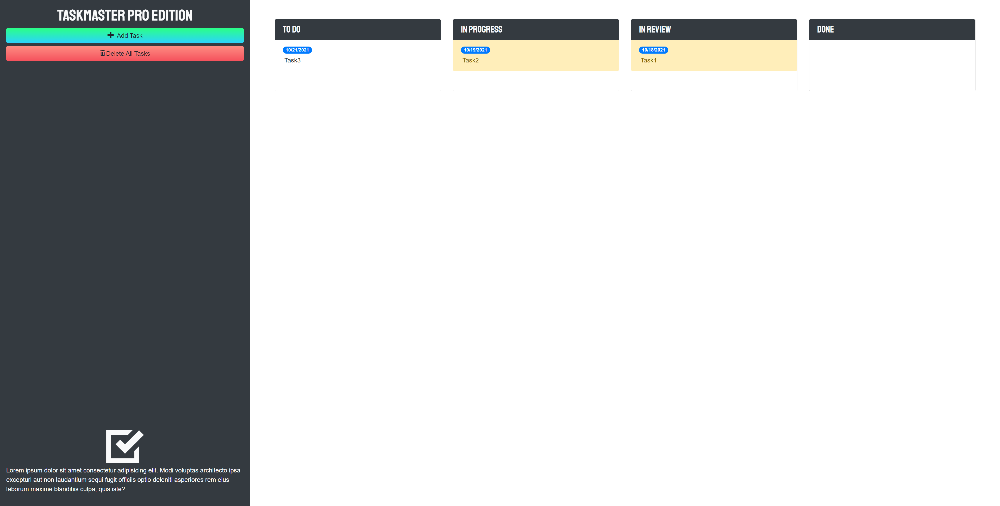

# Module 5

## CONTENTS OF THIS FILE

* Introduction
* Description
* Access
* Contribution
* Acknowledgement

## INTRODUCTION

UConn Bootcamp Module 5: Third-Party APIs 
Following UConn Bootcamp's tutorial guide to learn about libraries and frameworks that allow additional funcitonality into web application. Learn how to use two popular APIs: Boostrap and jQuery. 
 
Built With:
- HTML
- CSS
- JavaScript
- Bootstrap
- jQuery

## DESCRIPTION

Tutorial Lessons:

- Lesson 1: Updating Tasks with JQuery
    - Learn to consult documentation when faced with new libraries.
    - Traverse and manipulate the DOM using jQuery methods.
    - Attach delegated browser events to elements with jQuery methods.
    - Implement a better user experince with focus and blur events.
    - Practice other applications of `[this]` to distinguish between clicked elements.
- Lesson 2: Bootstrapped
    - Create responsive layouts using Bootstrap's grid system.
    - Use the UI components Bootstrap provides us.
    - Leverage Bootstrap's utility classes to avoid creating unnecessary custom CSS.
- Lesson 3: Drag and Drop with jQuery UI
    - Incorporate additional CDN links into a project.generate HTML elements and content.
    - Skim new documentation to quickly learn about new tools.
    - Use jQuery extensions to enable draggable elements.
- Lesson 4: A Matter of Time
    - Learn how to use jQuery UI's Datepicker widget with date-input form fields.
    - Implement another third-party JavaScript library using a CDN link.
    - Learn how JavaScript natively handles date and time functionality.
    - Use Moment.js to make handling JavaScript date and time functionality a lot easier.
- Lesson 5: Final UI/UX Improvements
    - Use JavaScript timer functions to schedule/automate logic.
    - Use a font library to implement custom fonts.
    - Use an icon library to implement font icons.
    - Override default Bootstrap styles using custom CSS.

## ACCESS
https://paperpatch.github.io/module_5/

Version edits and changes can be found in Github commit changes at https://github.com/paperpatch/module-5

## CONTRIBUTION
Made by Patrick Chen

## ACKNOWLEDGEMENT
UConn Bootcamp
